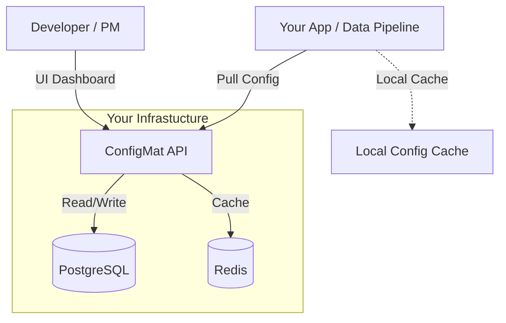

# ConfigMat - Configuration Management for Data & Backend Teams (Not Ready Yet)


ConfigMat is an open-source configuration management platform built specifically for **Data Engineers** and **Backend Teams**. It solves the problem of "hardcoded configs" and "messy env files" by providing a centralized dashboard where technical leads can define templates, and non-technical stakeholders (product managers, analysts) can safely update configuration values without touching code.

## 🚀 Why ConfigMat?

*   **For Data Teams**: Manage ETL pipelines, updated thresholds, and A/B test parameters dynamically. No more redeploying pipelines just to change a variable.
*   **For Backend Teams**: Centralize feature flags and service configurations.
*   **For The Whole Team**: Enable non-technical members to manage their own settings via a user-friendly UI, governed by strict schemas you define.
*   **Secure**: Zero-Knowledge architecture ensures we (and your infra provider) never see your secrets.

## 🏗️ Architecture



## 🛠️ How to Use

### 1. Set up the Server

From Source
- Clone the repo
- Run `docker-compose up` in /backend directory for the api server
- Run npm install && npm run dev in /ui directory for the frontend server.
- Make sure to set the environment variables in the .env file for both the api and ui servers.


From ConfigMat CLI (Coming Soon)
- Install CLI
- Run `configmat install app --dev` to install the docker images and build the ui app, then you just have to run `configmat run app --dev` to start the app in dev mode.

### 3. Integrate the SDK (Not Deployed Yet)

Use the SDKs to fetch configuration dynamically in your code.

**Python:**
```bash
pip install configmat
```

```python
from configmat import ConfigMat

# Initialize (API Key injected via CLI or Env Var)
client = ConfigMat()

# Get a value (uses local cache if API is down)
feature_enabled = client.get("feature_flags.new_dashboard", default=False)
```

**Node.js:**
```bash
npm install @configmat/sdk
```

```javascript
import { ConfigMat } from '@configmat/sdk';

const config = await ConfigMat.load();
const isEnabled = config.get('feature_flags.new_dashboard');
```

